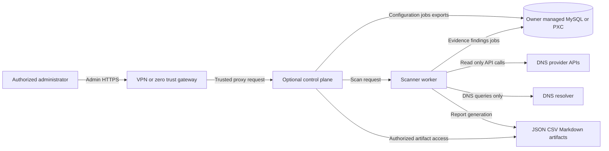
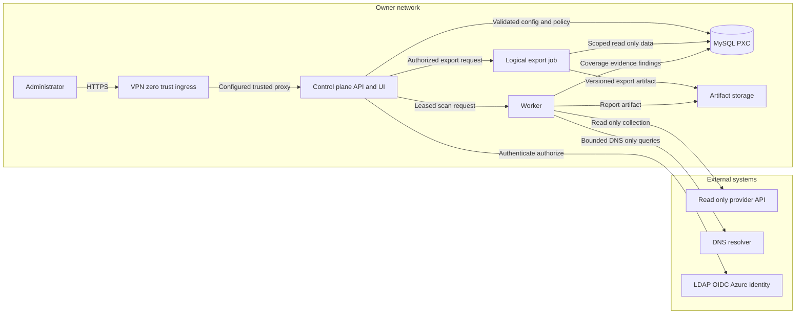
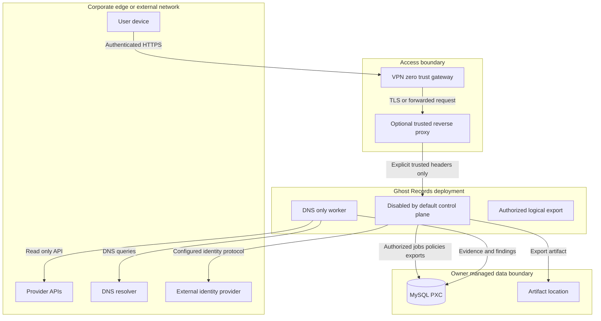
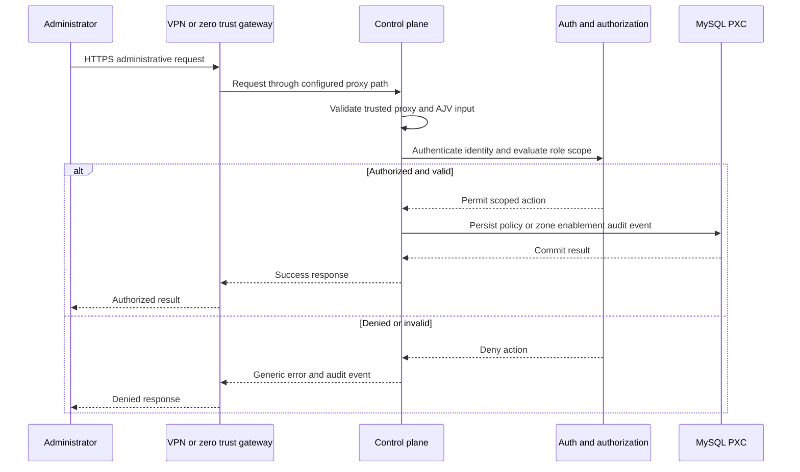
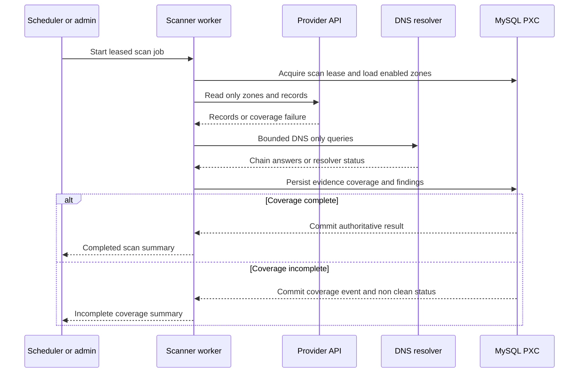
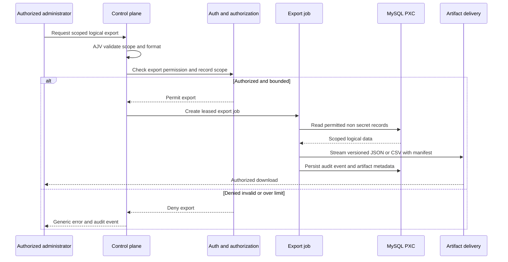

# Threat Model Review — 2026-08-19

## Executive Summary

This review evaluates the planned Ghost Records v2 architecture before implementation. The reviewed repository currently contains a narrow Bash v1 scanner and the approved v2 specification; no v2 JavaScript, MySQL, control-plane, container, Kubernetes, or CI implementation exists. Therefore, the threat model separates **repository-confirmed current behavior** from **operator-stated v2 requirements** and **planned controls that remain absent until implemented**.

The recommended v2 exposure is an internal control plane reachable only through a VPN or zero-trust gateway. The software must still fail safely if an owner deploys differently. The scanner-worker has high-value cloud/provider credentials and queries provider APIs plus DNS resolvers; the optional control plane manages sensitive inventory, policy, identity, exports, and historical DNS/registration evidence. The owner manages MySQL/PXC availability, backup, recovery, and database lifecycle, while v2 provides guidance, migration compatibility, and a logical administrative data-export capability.

The most material risks are incomplete provider coverage being mistaken for a clean scan; authority or authorization failure in the optional control plane; credential leakage through environment configuration, logs, exports, or errors; misuse of trusted-proxy headers; and database/worker concurrency loss. The legacy scanner itself contains evidence of silent empty-result fallbacks after failed Route 53 calls, which is precisely why v2 requires typed coverage events rather than empty inventories.[1]

| Summary item | Assessment |
| --- | --- |
| System under review | Ghost Records v2 specification, existing legacy Bash scanner, and planning artifacts. |
| Primary exposure | Recommended internal-only access via VPN or zero-trust gateway; owner deployment may differ. |
| Highest-value assets | Provider credentials, MySQL-resident evidence/history, policies, local identities, session/token material, export artifacts, and authoritative findings. |
| Planned security posture | DNS-only worker; read-only provider operations; MySQL/Sequelize-only state; optional disabled-by-default control plane; local authentication by default. |
| Current implementation state | V2 security controls are **ABSENT** because no v2 code or deployment implementation exists. |
| Immediate security gate | Complete T1–T4 and the corresponding focused security review before provider or control-plane functionality is introduced. |

## Risk Score

| Field | Value |
| --- | --- |
| Overall application risk score | **76 / 100** |
| Risk band | **High** |
| Confidence | **Medium** |
| Score volatility | **High** until T1–T15 establish the actual code, deployment, and identity boundaries. |
| Primary drivers | Sensitive provider credentials; security-finding/policy data; optional administrative API/UI; owner-selectable proxy/TLS deployment; external DNS/provider dependencies; database coordination; logical export capability. |
| What would lower the score | Evidenced implementation of centralized AJV validation, secret redaction, provider coverage gates, SQL/ORM guardrails, least-privilege authorization, explicit trusted-proxy configuration, export controls, and tested multi-instance migration/job behavior. |
| What would raise the score | Public Internet control-plane exposure; anonymous or weakly authorized administration; broad/unscoped provider credentials; untrusted forwarded headers; raw evidence by default; missing backup/restore tests; or a deviation from DNS-only inspection. |

## Scope

### In Scope

The review covers the v2 worker, the optional REST API and web UI, provider and ownership adapters, DNS-only resolution, MySQL/PXC persistence, scan-job coordination, reporting/artifacts, identity/authorization, logical export, deployment guidance, and the legacy v1 scanner as an evidence source and compatibility boundary.

### Out of Scope

Database operation, backup execution, restore execution, MySQL/PXC topology, VPN/zero-trust gateway administration, ingress/load-balancer administration, customer identity-provider administration, and owner-specific cloud account configuration are out of product scope. Their security impact is documented as deployment guidance and assumptions rather than claimed application controls.

### Evidence Hierarchy

| Evidence class | Material evidence |
| --- | --- |
| **Repository-confirmed** | `ghost_records.sh` is the only current executable; it invokes AWS CLI and `dig`, writes local files, and performs direct Route 53/EIP logic.[1] The repository currently has no v2 package, tests, infrastructure, or deployment files.[2] |
| **Operator-stated** | V2 is self-hosted; recommended internal-only access uses VPN/zero trust; environment variables provide v2 secrets; MySQL/PXC lifecycle is owner-managed; zones require explicit enablement; logical export supports owner recovery processes. |
| **Planned / specification** | JavaScript ES modules, AJV boundary validation, Sequelize-only MySQL access, DNS-only scanning, optional disabled-by-default control plane, local default authentication, explicit external identity adapters, artifact retention, and provider order are defined in the v2 specification.[2] |
| **ASSUMPTION** | Production deployments use HTTPS and trusted ingress configuration consistent with the owner’s environment. |
| **UNKNOWN** | Exact deployment topology, secret platform, TLS certificate lifecycle, OIDC/Azure tenant parameters, LDAP directory layout, MySQL/PXC topology, RPO/RTO, and network egress policy. |

## Exposure and Risk Calibration

The recommended production deployment is internal-only with access enforced by a VPN or zero-trust gateway. V2 must support both direct application TLS termination and proxy/ingress TLS termination, but it must not implicitly trust `X-Forwarded-*` headers. A deployment that terminates TLS upstream must supply an explicit trusted-proxy network/configuration boundary; otherwise client IP, protocol, secure-cookie, and audit data can be spoofed.

The scanner operates against resources that may expose internal architecture: DNS zones, records, aliases, resolution history, cloud ownership context, policy decisions, and selected registration metadata. Provider credentials are constrained to read-only operations, but they are nevertheless sensitive because they enumerate valuable infrastructure. The design’s DNS-only limitation removes endpoint probing and active claim behavior, but it does not remove risk from resolver resource consumption, crafted CNAME chains, false clean outcomes, or inaccurate ownership conclusions.

All database availability, backup, recovery, capacity, and lifecycle management remain owner responsibilities. The planned administrative logical export can help an owner recover application evidence but cannot replace MySQL/PXC-native backup and restore procedures. This distinction must remain explicit in product documentation, UI copy, manifests, runbooks, and export manifests.

## Contradictions and Reconciliation

| Topic | Repository-confirmed evidence | V2 operator/specification decision | Reconciliation |
| --- | --- | --- | --- |
| Scanner architecture | The legacy scanner is one Bash file with AWS CLI/JQ/DIG orchestration.[1] | V2 is a modular JavaScript ES-module application with MySQL/Sequelize and optional control plane.[2] | Preserve v1 unchanged; build v2 in a new isolated package. Do not treat Bash patterns as v2 architecture. |
| Provider error handling | Route 53 calls can fall back to empty JSON, including `{"HostedZones":[]}` and `{"ResourceRecordSets":[]}`, which can hide errors as empty inventory.[1] | V2 requires typed success/partial/failure coverage states and a non-clean outcome for incomplete collection.[2] | Implement provider adapters before analyzers; test pagination, access-denied, malformed, throttled, and partial states explicitly. |
| Administrative surface | Legacy v1 has no HTTP/UI surface. | V2 has an optional REST API and UI, disabled by default, with local authentication by default.[2] | Treat the control plane as a new trust boundary. It requires a separate implementation and security gate; it is not implied by worker/reporting work. |
| Recovery responsibility | The legacy scanner writes local output artifacts. | V2 persists authoritative data in owner-managed MySQL/PXC and adds logical export support. | Logical export is assistance only; owners retain all database lifecycle/backup/recovery responsibility. |

## Assumptions and Unknowns

| ID | State | Item | Owner / resolution path |
| --- | --- | --- | --- |
| A-1 | Operator-stated | Internal-only VPN/zero-trust access is the recommended deployment model. | Product documentation and deployment runbook. |
| A-2 | Operator-stated | Owners may expose the control plane differently; this is outside product control. | Fail-safe application configuration and deployment guidance. |
| A-3 | Operator-stated | V2 secrets are supplied through environment variables, commonly backed by Kubernetes Secrets. | T2 configuration design and deployment documentation. |
| A-4 | Operator-stated | Each zone must be manually enabled before scanning, within the configured principal’s granted access. | T5/T12/T13 policy and configuration design. |
| A-5 | Operator-stated | Owners manage database lifecycle, backup, restore, data loss, and service degradation. | T3/T8/T15A/T19 documentation and export design. |
| U-1 | UNKNOWN | Trusted ingress/reverse-proxy CIDRs, hop count, and TLS termination configuration. | Owner deployment configuration; T12 fail-closed proxy settings. |
| U-2 | UNKNOWN | Exact MySQL/PXC version, topology, connection limit, backup mechanism, and restore-testing cadence. | Owner runbook; T3/T19 validation. |
| U-3 | UNKNOWN | Identity-provider tenants, group/claim rules, directory base DNs, and certificate chains. | Owner identity configuration; T14 adapter configuration. |
| U-4 | UNKNOWN | Maximum zone/record volume and acceptable scan duration. | Load/performance test plan after Route 53 implementation. |

## Architecture and Data Flows

### DFD Level 0

### DFD Level 1

### Trust-Boundary View

## Key Flows

| Flow | Entry / trigger | Trust boundaries | High-value assets | Required controls |
| --- | --- | --- | --- | --- |
| F-1: Scheduled scan | Scheduler or authorized control-plane action | Control plane → worker → provider/resolver → database | Provider credentials, DNS inventory, findings | Leased jobs, read-only providers, AJV config, DNS-only egress, coverage states, bounded resolution. |
| F-2: Policy/zone enablement | Authorized administrator | Gateway/proxy → control plane → database | Scan scope, exception policy, audit trail | Trusted proxy, authentication, server-side authorization, AJV validation, CSRF where cookie-based, audit logs. |
| F-3: Local/external login | Administrator | Gateway/proxy → control plane → identity source | Passwords, sessions, directory/OIDC claims, roles | Local-by-default auth, Argon2id, throttling, TLS, LDAP escaping, OIDC claim validation, deny-by-default roles. |
| F-4: Logical export | Explicitly authorized administrator | Gateway/proxy → control plane → export job → database/artifact store | Findings/history, registration evidence, policy/audit records | Dedicated export permission, scope checks, secrets exclusion, manifest, limits, rate limit, audit events, artifact retention. |
| F-5: Retention purge | Leased scheduled job | Worker/control plane → database | Historical evidence, exports, audit data | Config validation, owner-defined retention, idempotent lease, bounded deletion, aggregate purge telemetry. |

## Threats Table

| ID | Flow | Summary | STRIDE | OWASP | Likelihood | Impact | Status | Rationale |
| --- | --- | --- | --- | --- | --- | --- | --- | --- |
| TM-1 | F-1 | Provider failure, pagination fault, or unavailable scope is treated as an empty inventory, creating false clean outcomes. | Tampering / Repudiation | A04 Insecure Design | High | High | **Open** | Repository-confirmed legacy calls fall back to empty Route 53 JSON after failure; v2 coverage controls are not yet implemented.[1] |
| TM-2 | F-1 | Crafted DNS names/chains exhaust resolver resources or induce misleading resolution observations. | Denial of Service / Tampering | A04 Insecure Design | Medium | High | **Open** | The legacy implementation invokes `dig` directly, including direct PTR and CNAME lookups; v2 bounded DNS-only resolver controls are planned but absent.[1] |
| TM-3 | F-1 | Provider credentials leak through environment logs, errors, reports, or export content. | Information Disclosure | A02 Cryptographic Failures / A05 Security Misconfiguration | Medium | Critical | **Open** | V2 uses environment variables for secrets; centralized configuration/redaction is planned in T2 but absent. |
| TM-4 | F-2 | A public/misconfigured deployment or spoofed forwarded headers bypasses intended internal-only access, protocol enforcement, rate limits, or audit source attribution. | Spoofing / Elevation of Privilege | A05 Security Misconfiguration / A07 Authentication Failures | Medium | High | **Open** | TLS may terminate at the app or proxy; trusted proxy configuration is owner-controlled and currently unknown. |
| TM-5 | F-2 / F-3 | Broken object-level or role authorization exposes cross-scope findings, policies, credentials metadata, or zone enablement controls. | Elevation of Privilege / Information Disclosure | A01 Broken Access Control | Medium | Critical | **Open** | Control plane, local auth, and external identity adapters are new planned components with no repository implementation. |
| TM-6 | F-4 | Logical export includes credentials, password hashes, sessions, unscoped records, or formula-active CSV content; an unauthorized user downloads it. | Information Disclosure / Tampering | A01 Broken Access Control / A03 Injection | Medium | Critical | **Open** | Export is a newly approved capability and needs dedicated authorization, exclusion, serialization, and download controls. |
| TM-7 | F-1 / F-5 | Concurrent workers, migration actors, or retention jobs corrupt baselines, duplicate findings, or exhaust MySQL/PXC connections. | Denial of Service / Tampering | A04 Insecure Design | Medium | High | **Open** | Shared persistence, multi-instance execution, and configurable pools are specified but absent. |
| TM-8 | F-1 | DNS-only evidence is overstated as a confirmed takeover or security incident. | Tampering / Repudiation | A04 Insecure Design | Medium | High | **Partially Mitigated** | The specification requires candidate status, confidence, coverage, and policy context; enforcement is not yet implemented.[2] |
| TM-9 | F-3 | LDAP filter/DN injection, weak TLS binding, or unvalidated OIDC claims grants unauthorized access. | Spoofing / Elevation of Privilege | A03 Injection / A07 Authentication Failures | Medium | Critical | **Open** | Detailed requirements exist, but directory/OIDC adapters are unimplemented. |
| TM-10 | F-5 | Over-broad retention, raw evidence capture, or failed purge exposes unnecessary infrastructure/registration data. | Information Disclosure | A02 Cryptographic Failures / A05 Security Misconfiguration | Medium | High | **Open** | Configurable retention and raw-evidence defaults are specified but no enforcement exists. |

## Mitigations Table

| Threat ID | Mitigation | Status | Directness | Location / Evidence | Notes / Open questions |
| --- | --- | --- | --- | --- | --- |
| TM-1 | Typed coverage events, scan-level non-clean state, provider fixtures, and visible coverage summaries. | **ABSENT** | Direct | T4, T5, AC-3, AC-7.[2] | Must be implemented before findings analyzers. |
| TM-2 | Bound query depth/count/concurrency/timeout/response size; DNS-only egress architecture test; no HTTP/TLS/application probes. | **ABSENT** | Direct | T6, AC-10A.[2] | Define resolver and egress policy before production deployment. |
| TM-3 | Central config, allowlisted environment inputs, structured redaction, secret-exclusion exports, and no CLI secret arguments. | **ABSENT** | Direct | T2 and T15A.[2] | Future secret-manager integration is not v2 scope. |
| TM-4 | Internal-only guidance, disabled-by-default control plane, explicit trusted proxy allowlist, correct protocol/cookie behavior, and owner runbook. | **ABSENT** | Direct | T12 and deployment assumptions.[2] | Exact proxy topology is UNKNOWN. |
| TM-5 | Local default auth, server-side roles/scopes, API/UI parity tests, no client-side authorization decisions, and audit records. | **ABSENT** | Direct | T13, T15, AC-18–AC-20.[2] | Add tenant/scope model only if future multi-tenant requirement is approved. |
| TM-6 | Dedicated export permission, server-side scope checks, strict AJV filters, manifest, row/rate limits, secrets exclusion, CSV safety, and audit/retention controls. | **ABSENT** | Direct | T15A planning amendment.[2] | Export is logical application data only, not a database backup. |
| TM-7 | Controlled migration actor, pool-budget validation, leased/idempotent jobs, Sequelize transactions, and multi-worker tests. | **ABSENT** | Direct | T3, T8, T11, AC-17/AC-17B.[2] | Exact PXC topology and budget are owner-defined. |
| TM-8 | Candidate-only taxonomy, confidence/evidence/coverage context, policy expiration, and human Application Security triage. | **PLANNED** | Direct | T9, AC-5–AC-8.[2] | Validate with ambiguous third-party/CDN fixtures. |
| TM-9 | LDAP TLS/certificate/bind requirements, context-aware LDAP escaping, issuer/audience/claim validation, and deny-by-default role mapping. | **ABSENT** | Direct | T14, AC-19.[2] | Directory/OIDC tenant configuration is owner-specific. |
| TM-10 | Owner-configurable retention validated with AJV, raw evidence disabled by default, scoped access, idempotent purges, and audit metrics. | **ABSENT** | Direct | T8, AC-16A.[2] | Owners must choose limits appropriate to their policy. |

## High-Risk Interaction Sequences

### Sequence 1: Authorized policy or zone-enable action

### Sequence 2: Coverage-aware DNS-only scan

### Sequence 3: Administrative logical export

## Validation Plan

| ID | Scenario | Evidence / success condition | Owner |
| --- | --- | --- | --- |
| V-1 | Simulate provider access denial, timeout, malformed response, pagination fault, and partial scope. | The scan emits typed coverage events and a non-clean outcome; no empty result is treated as clean. | Engineering + Application Security |
| V-2 | Use hostile DNS fixtures with cycles, excessive depth, mixed A/AAAA, private/reserved answers, and resolver failure. | Resolution stays within configured limits, emits bounded evidence, and produces no HTTP/TLS/application target traffic. | Engineering |
| V-3 | Deploy the control plane behind a proxy with and without approved trusted-proxy settings. | Untrusted forwarded headers do not alter client/protocol/security decisions; valid proxy settings preserve correct audit and secure-cookie behavior. | Platform Engineering + Application Security |
| V-4 | Exercise local admin, scoped service-owner, unauthorized user, LDAP, and OIDC identities against policy, finding, zone, and export operations. | Server-side authorization denies cross-scope actions; identity failures are generic and audit logging is redacted. | Engineering + Application Security |
| V-5 | Request exports with secrets, raw evidence, high-volume scope, spreadsheet-sensitive cells, revoked sessions, and unauthorized object identifiers. | Exports exclude prohibited data, enforce scope/limits/rate limits, safely serialize CSV, and produce audit evidence. | Engineering + Application Security |
| V-6 | Run migration, worker, retention, and export jobs concurrently against MySQL/PXC. | One migration actor runs; leases prevent corruption/duplicate authoritative results; pool budget remains within declared capacity. | Engineering + Database Owner |

## Owners

| Concern | Accountable owner | Supporting owner |
| --- | --- | --- |
| Application security policy, triage, risk acceptance, escalation | Application Security | DNS/service owner |
| DNS, provider, cloud, and application remediation | DNS or service owner | Application Security |
| Application code, validation, and release evidence | Engineering | Application Security |
| MySQL/PXC lifecycle, backups, restore, availability, capacity | Database owner | Platform Engineering |
| VPN/zero-trust, ingress, TLS termination, trusted proxy configuration | Platform / deployment owner | Application Security |
| Identity-provider tenants, certificates, group/claim mappings | Identity / deployment owner | Application Security |

## Open Questions

The product-level design questions are resolved. The following owner-specific deployment questions remain `UNKNOWN` and must be answered before a production deployment: trusted proxy CIDRs/hops; TLS certificate and ingress ownership; MySQL/PXC topology, backup tool, restore test cadence, connection budget, and recovery objectives; identity-provider tenant and role mappings; artifact-storage path; egress policy; expected scale; and provider credential scopes. These unknowns do not authorize insecure defaults.

## References

[1] [`ghost_records.sh`](ghost_records.sh), especially input handling at lines 47–64, Route 53 fallbacks at lines 305–336, direct DNS lookups at lines 375–439, and legacy artifact output at lines 456–615.

[2] [`docs/plans/ghost-records-v2.md`](docs/plans/ghost-records-v2.md), including acceptance criteria, implementation tasks, database-lifecycle amendment, and approval gates.
